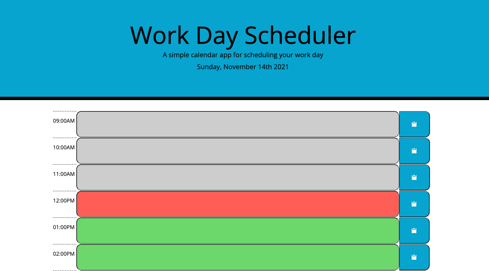

# Work Day Scheduler Starter Code

## Description
This work day scheduler allows the user to schedule an appointment during any hour of the day from 9am to 5pm. The time-blocks update in real time. The blocks in the past are greyed out, the blocks in the present are colored red, and the blocks in the future are colored green. Click the button next to the filled out input to save an appointment. If a slot is empty and a user clicks the button, the appointment will be deleted.

## Built With
* HTML
* CSS
* JavaScript

## Link to Deployed Application
https://osamadahnoun.github.io/Work-day-scheduler/

## Screenshot of Deployed Application

## Contribution
Work-Day-Scheduler created and designed with ❤️ by Osama Dahnoun